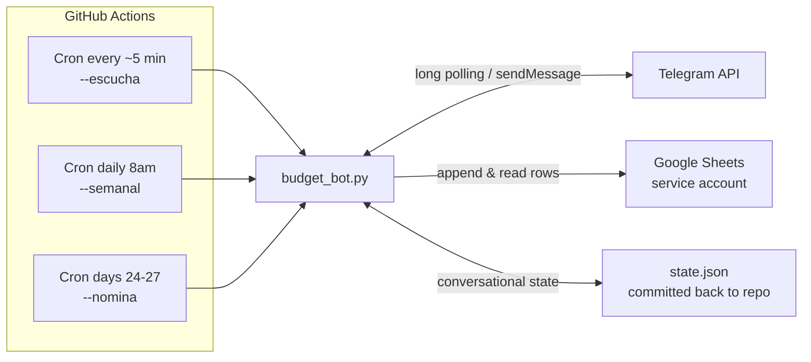

# 💚 Telegram Budget Bot

A conversational Telegram bot that guides you through your entire monthly pay cycle: it detects your payday, builds a weekly budget plan, listens for expense reports in natural language, records everything in Google Sheets, and proactively warns you before you overspend.

Built with **zero servers** — the whole bot runs on GitHub Actions cron schedules.

## ✨ Features

- **Payday detection** — Automatically finds the last Colombian business day on or before the 27th of each month, accounting for weekends and moveable holidays (via the `holidays` library).
- **Conversational cycle setup** — On payday, the bot asks how much money you have left, then splits it into 4 weekly budgets + a closing period, each with category allocations (delivery, outings, transport, savings).
- **Natural-language expense tracking** — Send *"hoy gasté 27.300 salida rappicard"* and the bot parses amount, category, and payment method using whole-word synonym matching ("rappi", "taxi", "café"… all map to their categories).
- **Google Sheets ledger** — Every expense is appended to a spreadsheet via a service account; cashback is computed there as a formula (the bot records facts, not derivations).
- **Weekly budget messages** — A daily cron checks whether today starts a new budget week; if so, it sends that week's plan and asks whether you had money left over from the previous week — any surplus rolls into the new week's budget.
- **Buffer flow** — If you overspend a week, the bot offers to borrow a fixed buffer from next week's budget and adjusts both weeks.
- **Proactive 70% alert** — The moment your spending crosses 70% of the weekly budget, the bot warns you — once per week, no nagging.
- **Cycle closing report** — On payday, before starting the new cycle, you get a budgeted-vs-actual breakdown per category, the most expensive week, and accumulated Rappicard cashback.
- **Pattern detection** — With 2+ complete cycles of history, the bot analyzes your ledger: dominant category, most expensive week of the cycle, highest-spending weekday, and average spend per cycle.

## 🧱 Architecture



Key design decisions:

- **Stateless runners, persistent state** — GitHub Actions gives you a fresh VM every run. Conversational state lives in `state.json`, which each run commits back to the repo using the built-in `GITHUB_TOKEN` (`[skip ci]` prevents workflow loops).
- **Broad crons, smart scripts** — Crons fire on wide windows (daily, days 24–27); Python decides internally whether today is actually payday or the start of a budget week. The bot never needs manual reconfiguration between cycles.
- **Facts in Sheets, plans in state** — Google Sheets is the source of truth for expenses; `state.json` holds the current cycle's budgets and balances. Historical analysis reconstructs past cycles by recomputing each month's payday.
- **Separation of concerns** — `budget_bot.py` handles Telegram and budget logic; `sheets.py` isolates all Google Sheets access.

## 🛠️ Tech Stack

| Layer | Tool |
|---|---|
| Language | Python 3.11 (`asyncio`, `httpx`) |
| Messaging | Telegram Bot API (long polling) |
| Storage | Google Sheets (`gspread` + service account) |
| Scheduling & compute | GitHub Actions (cron + `workflow_dispatch`) |
| Holidays | `holidays` (Colombian calendar) |

## 🚀 Setup

### 1. Clone and install

```bash
git clone https://github.com/AndreAVelez27/telegram-budget-bot.git
cd telegram-budget-bot
pip install -r requirements.txt
```

### 2. Create your Telegram bot

Talk to [@BotFather](https://t.me/botfather) to create a bot and get its token. Get your chat ID from [@userinfobot](https://t.me/userinfobot).

### 3. Set up Google Sheets access

1. Create a Google Cloud project and enable the **Google Sheets API**.
2. Create a **service account**, download its JSON key.
3. Create a spreadsheet with a `gastos` tab (columns: `fecha`, `monto`, `categoria`, `medio`) and share it with the service account's email.
4. Base64-encode the key: `base64 -i credentials.json`

### 4. Configure environment

For local testing, create a `.env` file:

```env
TELEGRAM_TOKEN=your_botfather_token
TELEGRAM_CHAT_ID=your_chat_id
GOOGLE_CREDENTIALS_B64=base64_encoded_service_account_json
GOOGLE_SHEETS_ID=your_spreadsheet_id
```

For production, add the same four values as **GitHub Actions secrets** (Settings → Secrets and variables → Actions).

### 5. Run

```bash
python3 budget_bot.py --nomina    # payday flow (asks for your remaining balance)
python3 budget_bot.py --semanal   # weekly budget (only acts if a week starts today)
python3 budget_bot.py --escucha   # process pending expense messages
python3 budget_bot.py --resumen   # full cycle summary
python3 budget_bot.py --insights  # spending patterns (needs 2+ cycles of data)
```

The workflow in [.github/workflows/budget.yml](.github/workflows/budget.yml) runs these automatically and can also be triggered manually from the Actions tab with a mode selector.

## 📱 The bot in action

<!-- TODO: add screenshots -->
> *Screenshots coming soon: payday conversation, weekly budget message, expense registration, and the 70% alert.*

## ⚠️ Known limitations

- GitHub Actions cron schedules are **best-effort**: during peak hours, runs can be delayed 30–90 minutes. Expense confirmation latency depends on it. A webhook-based deployment (planned) would make responses instant.
- Single-user by design (one chat ID). Multi-user support is on the roadmap along with a Streamlit dashboard.

## 📄 License

[MIT](LICENSE)
